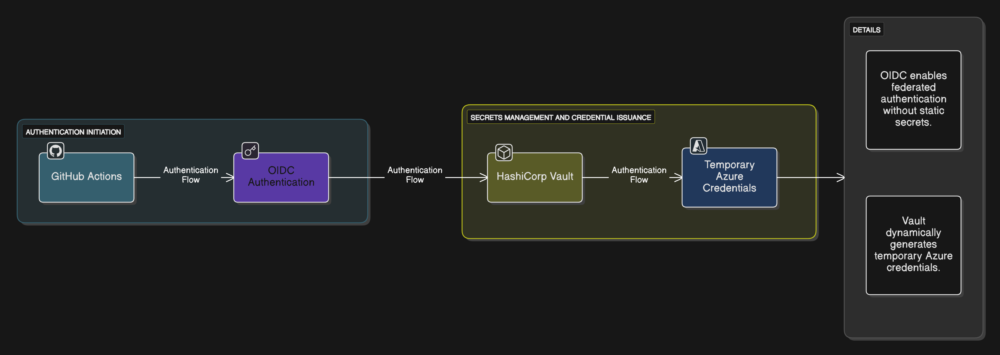
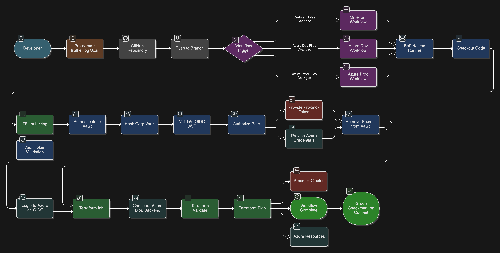

# Homelab Infrastructure as Code (Terraform)

<table>
  <tr>
    <td>
      
    </td>
    <td>
      
    </td>
    <td>
      
    </td>
  </tr>
</table>

This repository powers the infrastructure layer of my [FasHomeLab project](https://github.com/fashomelab/corneb), a hybrid homelab inspired by the automation of Horizon’s Faro Automated Solutions. What began as a single Proxmox server has grown into a fully declarative setup managing VMs on Proxmox and resources in Azure. This is my DevOps sandbox, where I experiment with Terraform to build scalable, secure infrastructure—paired with my [Ansible repo](https://github.com/fashomelab/ansible) for configuration.

---

## 🌟 Why This Repo?

I got tired of manually spinning up VMs and Azure resources, so I turned to Terraform to make my homelab infrastructure repeatable and version-controlled. This repo automates provisioning for my Proxmox cluster and Azure environments, saving me hours of setup time and ensuring consistency. It’s a core part of my [FasHomeLab portfolio](https://github.com/fashomelab/corneb), showcasing IaC skills in a real-world setup. Want to build your own hybrid-cloud lab? Fork this, tweak the vars, and deploy your infrastructure!

---

## 🚀 Key Features

- **Hybrid-Cloud Management**: Provisions resources across on-premise Proxmox (`fashomelab`) and Azure (`azhomelab/dev`, `azhomelab/prod`) environments.
- **Modular Design**: Uses reusable modules (e.g., VMs, databases) for maintainability and scalability.
- **Secure Remote Backend**: Bootstraps an Azure Storage Account for safe Terraform state storage.
- **Automated CI/CD**: Validates changes via GitHub Actions with separate pipelines for Proxmox, Azure Dev, and Azure Prod.
- **Secretless Workflow**: Leverages OIDC and HashiCorp Vault for dynamic, secure credential management in CI/CD.

### Key Results
- Reduced infrastructure provisioning time by ~90% with automated Terraform workflows.
- Managed deployment across 20+ Proxmox VMs and 2 Azure environments (dev/prod).
- Implemented secretless CI/CD, securing 100% of credential handling with Vault and OIDC.

---
## 🏗️ Repository Structure

The repository is organized into `bootstrap`, `environments`, and `modules` to create a clear, scalable, and professional workflow.

<pre>
.
├── .github/workflows/
│   ├── terraform-azhomelab-dev.yaml   # CI pipeline for Azure Dev
│   ├── terraform-azhomelab-prod.yaml  # CI pipeline for Azure Prod
│   └── terraform-fashomelab.yaml    # CI pipeline for Proxmox
├── bootstrap/                     # Initial setup for the Azure backend
└── labsterraform/
    ├── environments/
    │   ├── azhomelab/
    │   │   ├── dev/                 # Root configuration for Azure Dev
    │   │   └── prod/                # Root configuration for Azure Prod
    │   └── fashomelab/              # Root configuration for Proxmox
    └── modules/
        ├── azure-database/          # Reusable module for Azure PostgreSQL
        ├── azure-vm-linux/          # Reusable module for Azure Linux VMs
        └── ... and other modules
</pre>

* **`/bootstrap`**: A standalone Terraform configuration to create the foundational Azure resources (Resource Group, Storage Account) needed for the remote state backend. This is the first thing you run.
* **`/labsterraform/environments`**: Contains the root configurations for each distinct environment. This is where you run `terraform plan` and `apply` for day-to-day operations. Each environment is completely isolated.
* **`/labsterraform/modules`**: Contains reusable, generic building blocks (like creating a VM or a database) that are called by the environment configurations.

---
## ⚙️ Automation & CI/CD Workflow

A multi-workflow CI/CD pipeline automatically validates all infrastructure changes. This setup is a best practice for managing a complex monorepo with separate environments.

- **Dynamic Secrets Management**: Leverages OIDC and HashiCorp Vault for secure, temporary credential generation, eliminating static secrets.

<div align="center">
  
  <p><em>Secretless Authentication Using OIDC and HashiCorp Vault.</em></p>
</div>

### Multi-Workflow Strategy

To ensure efficiency and isolation, three separate, path-based GitHub Actions workflows are used:
* **`terraform-fashomelab.yaml`**: Triggers on changes to the on-premise `fashomelab` environment.
* **`terraform-azhomelab-dev.yaml`**: Triggers on pushes to the `develop` branch to provide continuous validation of the `dev` environment.
* **`terraform-azhomelab-prod.yaml`**: Triggers on pull requests to the `main` branch, acting as a production gatekeeper.

<div align="center">
  
  <p><em>CI/CD Pipeline for Automated Terraform Validation Across Environments.</em></p>
</div>

### The CI Pipeline Process

On every relevant event, the correct workflow performs the following steps on a self-hosted runner:

1.  **Scan for Secrets:** Runs TruffleHog to ensure no sensitive credentials have been accidentally committed.
2.  **Lint Code:** Uses TFLint to check the code against Azure and Terraform best practices.
3.  **Authenticate Securely:** Connects to HashiCorp Vault using a JWT/OIDC role to get a short-lived token.
4.  **Initialize & Validate:** Runs `terraform init` to configure the Azure remote backend and `terraform validate` to check for syntax errors.
5.  **Create Plan:** Runs `terraform plan` to generate an execution plan for review.

This ensures that no code is merged without being automatically checked for quality, security, and correctness against the existing infrastructure state.
---
## 🚀 Getting Started

This repository can be used to manage your own hybrid infrastructure.

### 1. Bootstrap the Backend

The first step is to create the secure Azure Storage Account for your Terraform state.

1.  Navigate to the `bootstrap` directory.
2.  Copy `bootstrap.tfvars.example` to `bootstrap.tfvars` and fill in your details.
3.  Run the following commands:
    ```bash
    terraform init
    terraform apply
    ```
4.  Note the output names (like the storage account and resource group). You'll need these for your environment configurations.

### 2. Configure an Environment

Next, configure one of the main environments (e.g., `azhomelab/prod`).

1.  Navigate to the environment directory (e.g., `/labsterraform/environments/azhomelab/prod`).
2.  Update the `backend.tf` file with the resource names from the bootstrap step.
3.  Create a `.tfvars` file (e.g., `prod.tfvars`) from the provided `.tfvars.example` and populate it with your desired infrastructure settings.
4.  Run `terraform plan` and `terraform apply`.

---
## 🤝 Contributing
Contributions are welcome! Fork the repo, customize modules or vars, or submit PRs to enhance Proxmox/Azure support. Check issues for ideas.

---
## 📜 License
This project is licensed under the MIT License. See the [LICENSE.md](LICENSE.md) file for details.
